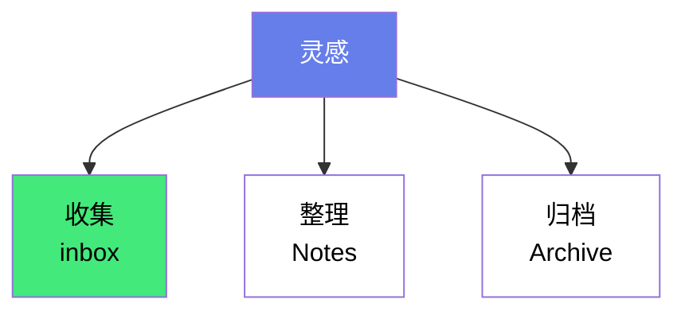

## 🎯 知识管理流程



```mermaid
graph TD
    T[灵感] --> A[收集 <br> inbox]
    T --> S[整理<br> Notes]
    T --> C[归档<br> Archive]
    style T fill:#667eea,color:#fff
    style A fill:#43e97b,color:#000
    style S fill:#ffffff,color:#000
    style C fill:#ffffff,color:#000
```

📥     [[01 Inbox]]    →      🗂️ [[02 Notes]]          →     📁 [[03 Archive]]


```dataview
list from "01 Inbox"
sort file.name asc
```
