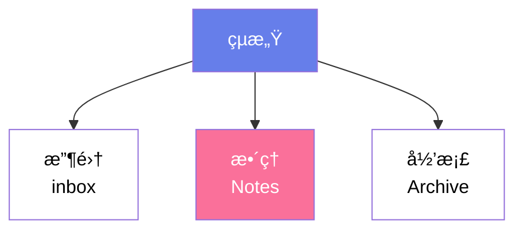

## 🯠知识管ç†æµç¨‹



```mermaid
graph TD
    T[çµæ„Ÿ] --> A[收集 <br> inbox]
    T --> S[æ•´ç†<br> Notes]
    T --> C[å½’æ¡£<br> Archive]
    style T fill:#667eea,color:#fff
    style A fill:#ffffff,color:#000
    style S fill:#fa709a,color:#fff
    style C fill:#ffffff,color:#000
```
📥     [[01 Inbox]]    →      ğŸ—‚ï¸ [[02 Notes]]          →     📠[[03 Archive]]

```dataview
list from "02 Notes"
sort file.name asc
```
