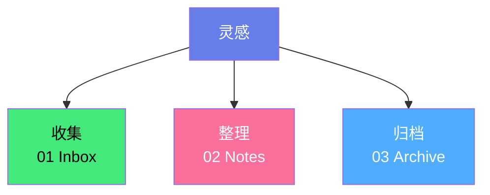

## 🎯 知识管理流程

---

## 🗂️ 探索主题

- [幼教实操](/category/education) - 课程活动
- [英语词汇](/category/english) - 单词拆解
- [短视频创作](/category/video) - 脚本模板
- [自动化工具](/category/tools) - 工作流优化

---

## 🌟 精选专题

- [Obsidian 快速入门](/guide/obsidian) `指南`
- [第二大脑方法](/guide/second-brain) `方法`
- [短视频脚本库](/guide/video) `模板`

---

## 🔄 最近更新

1. [情绪管理课堂设计](/notes/emo1) - 2025-11-30  
2. [高一英语词汇整理](/notes/vocab1) - 2025-11-28  
3. [短视频创作模板](/notes/video1) - 2025-11-25  

---

## 🗺️ 知识概览

- 核心
  - 概念 A
  - 概念 B

---

测试测试测试测试测试测试测试测试测试测试 #职场 