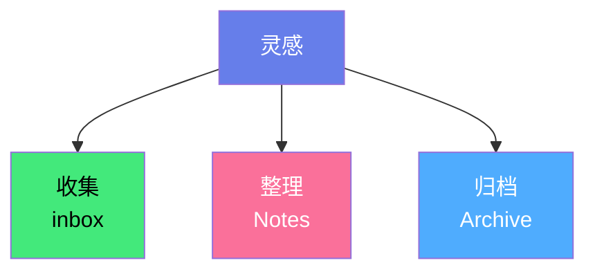
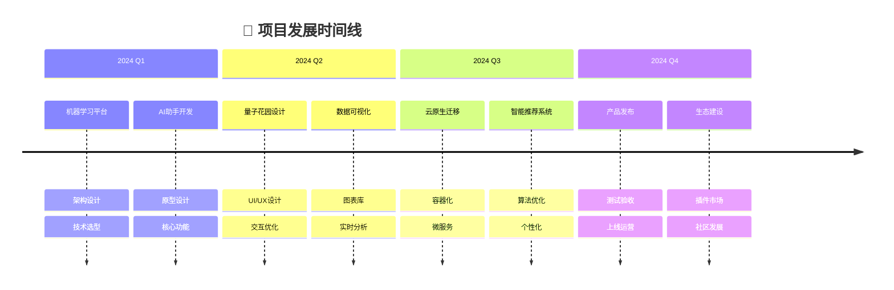
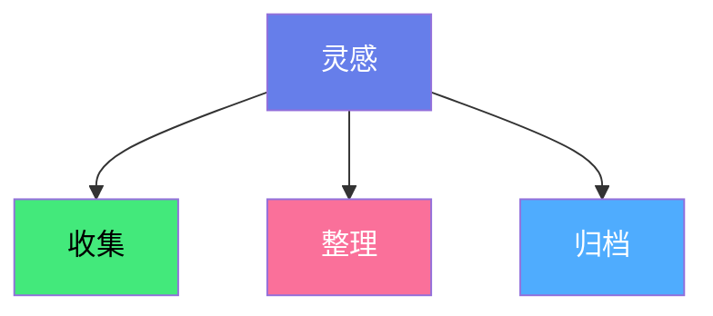

## 🎯 知识管理流程



📥     [[01 Inbox]]    →      🗂️ [[02 Notes]]          →     📁 [[03 Archive]]


🌿思想在这里生根，知识在这里发芽。

欢迎来到我的个人知识库，这里记录了学习笔记、创作灵感和项目实践。每个内容都是可探索、可复用的知识碎片。

---

## 🗂️ 探索主题

- [幼教实操](/category/education) - 课程活动
- [英语词汇](/category/english) - 单词拆解
- [短视频创作](/category/video) - 脚本模板
- [自动化工具](/category/tools) - 工作流优化

---

## 🌟 精选专题

- [Obsidian 快速入门](/guide/obsidian) `指南`
- [第二大脑方法](/guide/second-brain) `方法`
- [短视频脚本库](/guide/video) `模板`

---

## 🔄 最近更新

1. [情绪管理课堂设计](/notes/emo1) - 2025-11-30  
2. [高一英语词汇整理](/notes/vocab1) - 2025-11-28  
3. [短视频创作模板](/notes/video1) - 2025-11-25  

---

## 🗺️ 知识概览

- 核心
  - 概念 A
  - 概念 B

---


### 🌠 基于你的活动推荐

#### 🟥 高优先级
**完成机器学习项目文档**
- 基于你最近的搜索和笔记活动
- 📊 **进度**: 65% 完成
  ```mermaid
  graph LR
  A[65% 完成] --> B[100%]
  style A fill:#ff4444
  style B fill:#667eea,color:#fff
  ```







```dataview
TABLE "📥" as 收集, "🗂️" as 整理, "📁" as 归档
WHERE file.name = "主页"
```

